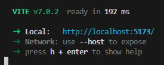

# 🧠 Tutoriales SPA con JavaScript vanilla

Este repositorio contiene dos implementaciones distintas de una SPA (Single Page Application) utilizando JavaScript puro (Vanilla JS), sin frameworks.

---

## Estructura

```
tutoriales-spa/
├── ajax-spa/ # SPA usando fetch y History API
├──── index.html
├──── app.js
└──── pages/
├─────── home.html
├── hash-routing/ # SPA usando window.location.hash
│ ├── index.html
│ └── app.js
├── history-api/ # SPA usando History API (pushState)
│ ├── index.html
│ └── app.js
├── package.json
└── README.md
```

---

## ⚙️ Requisitos

- Node.js (versión 18 o superior recomendado)
- npm

---

## 🚀 Instalación

1. Clona el repositorio

```bash
git clone https://github.com/elcheryu-u/guia-spa.git
cd guia-spa
```

2. Instala las dependencias:

```bash
npm install
```

---

## ▶️ Iniciar cada implementación

### - Hash Routing

Usa `window.location.hash` para el enrutamiento (`#/ruta`).

```bash
npm run start:hash
```

### - History API

Usa `history.pushState()` y `popstate` para URLs limpias (`/ruta`).

```bash
npm run start:history
```

Abre el navegador en `http://localhost:5173`



_**📌 Importante:** Para que el SPA con History API funcione correctamente al recargar o acceder directamente a rutas, el servidor debe devolver siempre index.html. Vite ya lo maneja por defecto en desarrollo._

---

### - AJAX + InnerHTML (Adicional)

Este enfoque carga contenido dinámico desde archivos `.html` sin recargar la página usando `fetch()`.

```bash
npm run start:ajax
```

**📁 Estructura sugerida:**

```
ajax-spa/
├── index.html
├── app.js
└── pages/
    ├── home.html
    ├── about.html
    └── contact.html
```

**📜 Cómo funciona:**

- Se interceptan los clics en los enlaces
- Se usa `fetch()` para cargar el archivo correspondiente desde `/pages`
- El contenido se inserta en el `<main id="app">` usando `innerHTML`
- Se puede combinar con `history.pushState()` para URLs limpias